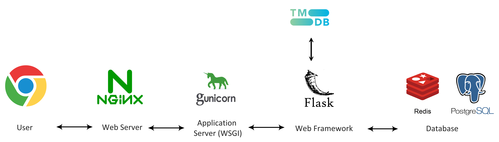
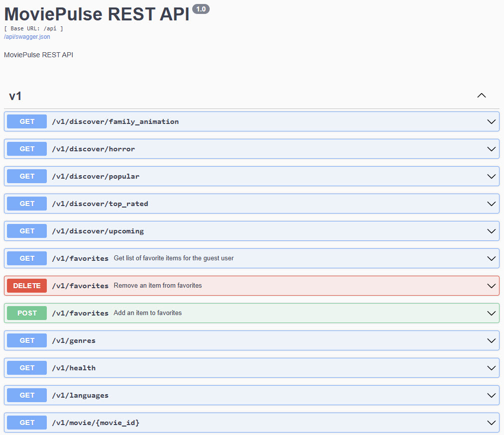

# MoviePulse

My family loves watching movies and TV shows. But with so many titles to choose from — and new ones dropping every week — picking something everyone agrees on for movie night can turn into a mini-debate.

This inspired me to build something useful and fun: a web service that fetches trending movies and TV shows. It can show detailed info for each title, and offers a simple UI where my family can browse and vote on what to watch next. It's become our digital movie night assistant!



The backend is built using Python Flask, which serves a RESTful web service exposing various endpoints to interact with movie and TV show data. It runs on my local Raspberry Pi cluster, specifically on the `artemis` node within my home network.

Since Flask’s built-in development server is not suitable for production use, I’ve deployed the backend using a Flask + Gunicorn + Nginx stack. This architecture ensures reliability, performance, and scalability for concurrent access.

All movie and TV data is fetched from The Movie Database (TMDb) - [API Reference](https://developer.themoviedb.org/reference/intro/getting-started). It provides a robust and well-documented REST API for accessing a wide range of metadata including trending content, credits, release information, etc.

To improve response time and reduce redundant calls, Flask leverages an in-memory Redis cache. Frequently accessed data is temporarily stored in Redis, allowing the system to serve cached results quickly rather than querying TMDb on every request. Redis is deployed in a Docker container to maintain state across reboots.

While Redis is ideal for caching transient data, persistent user-related information—such as interaction logs, preferences, watch history, and session metadata—is stored in a PostgreSQL database. SQLAlchemy serves as the ORM layer, providing a clean and Pythonic interface to interact with the database.

## Project Structure

The project structure looks like:

    moviepulse/
        ├── app.py
        ├── tmdb_client.py
        ├── models_redis.py
        ├── models_sql.py
        ├── requirements.txt
        ├── docker-compose.yml
        ├── .env  ---> API token
        ├── templates/
        |   ├── index.html
        |   ├── movie_detail.html
        |   ├── tv_detail.html
        |   ├── favorites.html
        ├── static/
        │   ├── css
        │   └── js

```text
# nginx.conf

server {
    listen 80;

    location / {
        proxy_pass http://127.0.0.1:8000;
        proxy_set_header Host $host;
        proxy_set_header X-Real-IP $remote_addr;
        proxy_set_header X-Forwarded-For $proxy_add_x_forwarded_for;
    }
}
```

## Getting Started

Set up a Python virtual environment and install the required dependencies listed in requirements.txt:

```bash
python3 -m venv venv
source venv/bin/activate
pip install -r requirements.txt
```

Additionally, create a `.env` file in the root directory of the project to securely store your TMDB API key. The file should include the following entry:

    export TMDB_API_TOKEN=your_api_key_here

This `.env` file will be used to load environment variables required for accessing the TMDB REST API.

Run Flask with Gunicorn:

```bash
gunicorn --workers 4 --bind 127.0.0.1:8000 app:app
```

Sample output is:

```text
[2025-04-20 00:08:08 -0700] [2164478] [INFO] Starting gunicorn 23.0.0
[2025-04-20 00:08:08 -0700] [2164478] [INFO] Listening at: http://127.0.0.1:8000 (2164478)
[2025-04-20 00:08:08 -0700] [2164478] [INFO] Using worker: sync
[2025-04-20 00:08:08 -0700] [2164479] [INFO] Booting worker with pid: 2164479
[2025-04-20 00:08:08 -0700] [2164480] [INFO] Booting worker with pid: 2164480
[2025-04-20 00:08:08 -0700] [2164481] [INFO] Booting worker with pid: 2164481
[2025-04-20 00:08:08 -0700] [2164482] [INFO] Booting worker with pid: 2164482
```

Option `--workers 4` runs 4 worker processes to handle requests.

More workers mean better handling of concurrent requests but higher resource usage.

Option `--bind 127.0.0.1:8000` binds the server to 127.0.0.1 (localhost) on port 8000.

This means the server is only accessible from the local machine.

Gunicorn offers several worker types, including synchronous (sync), threaded, asynchronous, and multiprocessing workers. For this deployment, I’m using the default sync worker, which is well-suited for lightweight applications with low concurrency requirements. Nginx is configured as a reverse proxy and is now successfully forwarding requests to the Gunicorn server.

To enable name-based access within the local network, I added a DNS entry for `moviepulse.home` pointing to the IP address of the artemis node hosting the server.

- Web Interface: http://moviepulse.home/
- Swagger API docs: http://moviepulse.home/api/docs
- API Base URL: http://moviepulse.home/api/v1/

MoviePulse exposes a dedicated set of RESTful APIs, which are consumed by the frontend for all data queries.



## Run as a systemd Service

To run the gunicorn in the background and start it on system boot:

1. Copy the service file:
```bash
sudo cp moviepulse.service /etc/systemd/system/moviepulse.service
```

2. Reload systemd and start the service:
```bash
sudo systemctl daemon-reexec
sudo systemctl daemon-reload
sudo systemctl enable moviepulse
sudo systemctl start moviepulse
```

3. Check status and logs:
```bash
sudo systemctl status moviepulse
```

4. On service failure check the journal logs:
```bash
journalctl -u moviepulse -n 50 --no-pager
```

Ensure that your virtual environment and script paths are correctly set in the service file.

## Frontend Design

The MoviePulse frontend is developed using standard web technologies: HTML, CSS, and JavaScript. It is designed to be responsive, lightweight, and user-friendly, offering a smooth browsing experience across both desktop and mobile devices.

The frontend interacts with the backend exclusively through RESTful APIs exposed by the Flask application. These endpoints are responsible for delivering real-time data from TMDB (The Movie Database) based on user interaction and filter selections.

The main page is organized into several content-rich sections, each populated dynamically via API calls:

- **Trending Movies** – Displays movies currently trending on TMDB
- **Trending TV Shows** – Highlights TV shows that are currently trending
- **Upcoming Movies** – Lists movies that are scheduled for upcoming release
- **Popular Movies** – Shows movies with high popularity based on user engagement, such as views and watch-lists
- **Top-Rated Movies** – Presents movies with the highest average user ratings on TMDB
- **Horror Movies** – Curated list of horror genre titles
- **Family Animations** – Family-friendly animated titles

Clicking on any movie or TV show card navigates the user to a dedicated details page for that title. This page provides comprehensive information retrieved from the TMDB API. This detailed view allows users to explore each title in depth, offering a richer and more engaging discovery experience beyond the main listing pages.

For Popular Movies and Top-Rated Movies, the frontend provides advanced filtering options that allow users to tailor results based on: Genre, Language, Region, and Year of Release. These filters are implemented using multi-select dropdowns and input fields, providing flexibility in content discovery.

TODO: add a gif picture - adding multiple genre - year


----------------------------

search movie and tv shows - as you type live result (John Wick)

clicking on the heart will add that title into favorite

----------------------------

use cozyla to load the web page

adding a gif from dani playing with cozila and navigating

to find age-appropriate content for your 6-year-old son like cartoons or family movies.

----------------------------

Api service - send new movies to discord

my wife is a big fan of marvel movies - send email when a marvel movie is released
